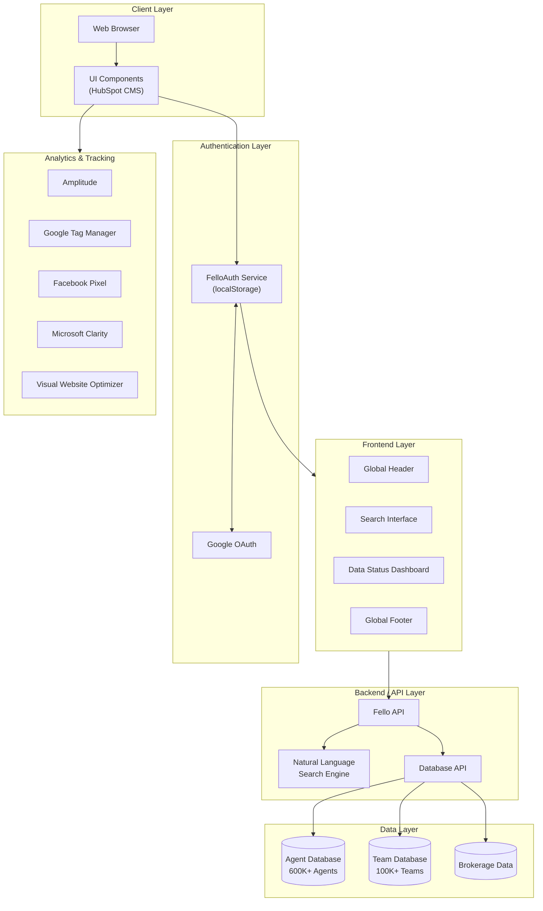
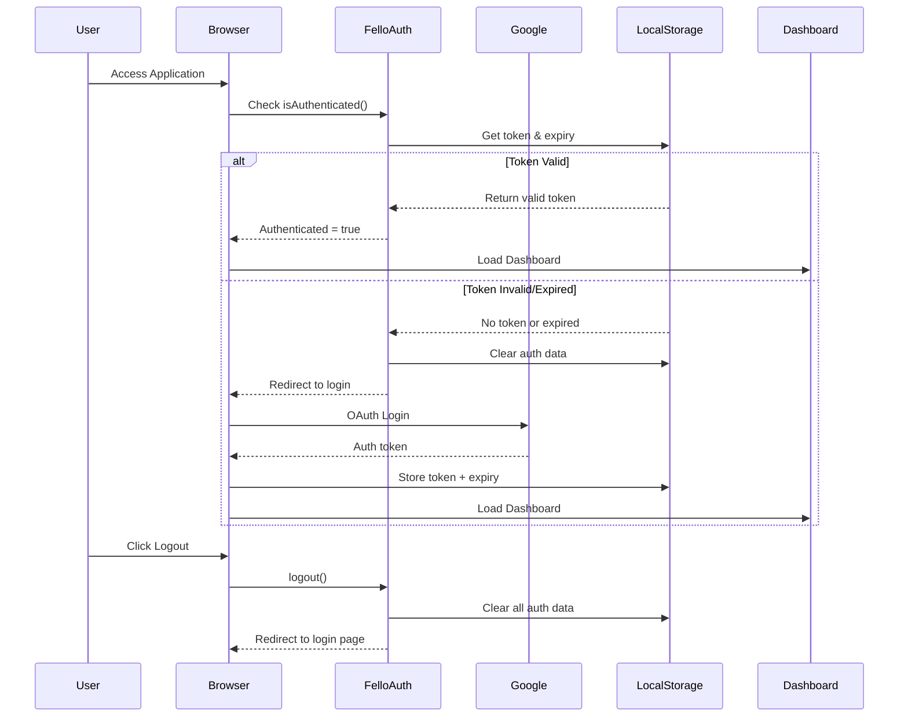
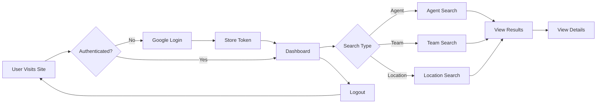

# MEGA Agent Directory - Application Overview

## 📋 Project Description

MEGA Agent Directory is a web application designed for searching and discovering real estate agents and teams across the United States. The platform provides access to a database of over **600,000 agents** on **100,000+ teams**, enabling users to search using natural language queries or structured database APIs.

---

## 🏗️ Architecture Diagram



---

## 🔐 Authentication Flow



---

## 🎯 Key Features

### 1. **Multi-Mode Search**
| Search Type | Description |
|-------------|-------------|
| **Agent Search** | Search individual real estate agents |
| **Team Search** | Search real estate teams |
| **Location Search** | Search by geographic location |

### 2. **Data Status Dashboard**
- **Total Agents Count** with tier breakdown:
  - Fully Enriched (complete profile data)
  - Partially Enriched (core identity + contact)
  - Basic Profile (limited information)

### 3. **Entity Classification**
| Entity Type | Description |
|-------------|-------------|
| **Mega Teams** | 20+ agents |
| **Large Teams** | 11-20 agents |
| **Medium Teams** | 5-11 agents |
| **Small Teams** | 2-5 agents |
| **Individual** | Solo agents |
| **Market Center** | Brokerage offices |

### 4. **Top Brokerage Tracking**
- Keller Williams
- RE/MAX
- eXp Realty
- Berkshire Hathaway Home Services (BHHS)

---

## 🔧 Tech Stack

### Frontend
| Technology | Purpose |
|------------|---------|
| HTML5/CSS3 | Structure & Styling |
| JavaScript (ES6+) | Client-side logic |
| HubSpot CMS | Content Management |
| Lottie Web | Animations |
| ScrollMagic | Scroll animations |
| Instrument Sans | Typography |

### Authentication
| Technology | Purpose |
|------------|---------|
| Google OAuth | User authentication |
| localStorage | Token persistence |
| Custom FelloAuth | Auth state management |

### Analytics & Tracking
| Service | Purpose |
|---------|---------|
| Amplitude | Product analytics |
| Google Tag Manager | Tag management |
| Facebook Pixel | Ad tracking |
| Microsoft Clarity | Session recording |
| VWO | A/B testing |
| Kiflo | Partner tracking |
| FirstPromoter | Affiliate tracking |
| Snitcher | Lead identification |
| Vector | Analytics |

### Hosting
| Service | Purpose |
|---------|---------|
| fello.ai | Primary domain |
| HubSpot | CMS hosting |

---

## 📁 Application Structure

```
MEGA Agent Directory
├── 🌐 Public Pages
│   ├── /mega-agent-directory          # Login/Landing page
│   ├── /mega-agent-directory/search   # Main search dashboard
│   └── /mega-agent-directory/find-team # Team search with filters
│
├── 🔐 Authentication
│   └── FelloAuth (Client-side)
│       ├── isAuthenticated()
│       ├── logout()
│       └── clearAuthData()
│
├── 🎨 UI Components
│   ├── Global Header
│   ├── Search Input
│   ├── Tab Navigation (Agent/Team/Location)
│   ├── Data Status Cards
│   └── Global Footer
│
└── 📊 Data Displays
    ├── Total Agents Counter
    ├── Enrichment Tier Breakdown
    ├── Entity Type Distribution
    └── Brokerage Statistics
```

---

## 🔄 User Flow



---

## 🔑 Authentication Configuration

```javascript
const AUTH_CONFIG = {
    tokenKey: 'fello_auth_token',      // localStorage key for auth token
    userKey: 'fello_user_data',         // localStorage key for user data
    tokenExpiry: 'fello_token_expiry',  // localStorage key for expiry
    loginPageUrl: 'https://fello.ai/mega-agent-directory'  // Redirect URL
};
```

---

## 📊 Data Metrics (Dashboard Elements)

| Element ID | Description |
|------------|-------------|
| `#total` | Total agent count |
| `#tier1` | Fully enriched agents |
| `#tier2` | Partially enriched agents |
| `#tier3` | Basic profile agents |
| `#indi-cri` | Total entities count |
| `#mega` | Mega teams count |
| `#lrg` | Large teams count |
| `#mdm` | Medium teams count |
| `#sml` | Small teams count |
| `#indv` | Individual agents count |
| `#marc` | Market centers count |
| `#kw` | Keller Williams agents |
| `#remax` | RE/MAX agents |
| `#expt` | eXp Realty agents |
| `#bhhs` | BHHS agents |

---

## 🌐 Related URLs

| URL | Purpose |
|-----|---------|
| `https://fello.ai/mega-agent-directory` | Login page |
| `https://fello.ai/mega-agent-directory/search` | Main dashboard |
| `https://fello.ai/mega-agent-directory/find-team` | Team finder |
| `https://app.fello.ai/auth/login` | App login |
| `https://connect.hifello.com/auth/login` | Connect login |

---

## 📝 Notes

- Total US real estate agents estimated at **1,500,000** (based on LLM research)
- Application uses client-side authentication with token expiration
- All data fetched dynamically via API calls
- Dashboard updates in real-time with enrichment statistics